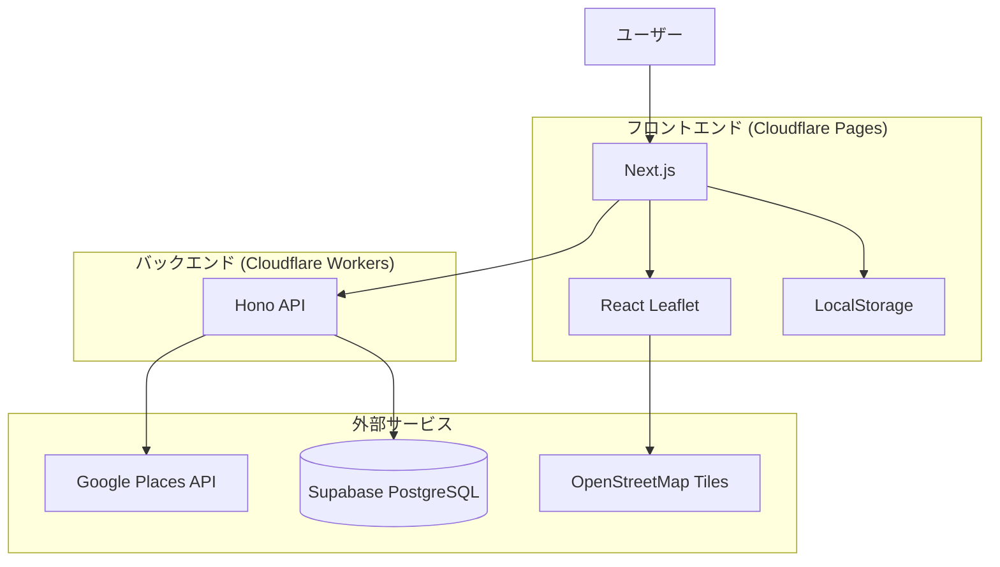
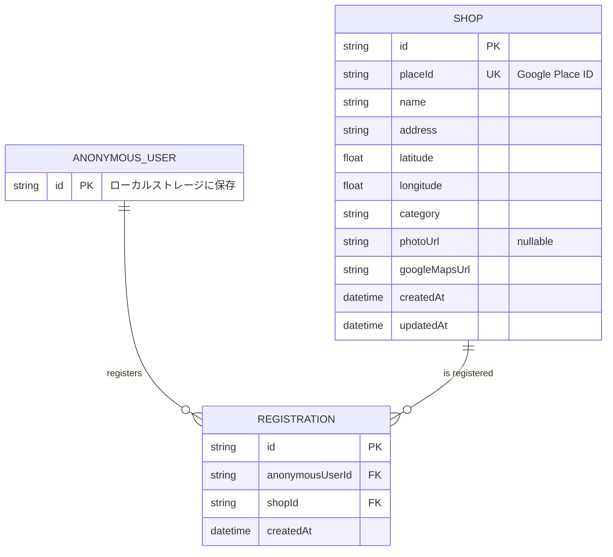
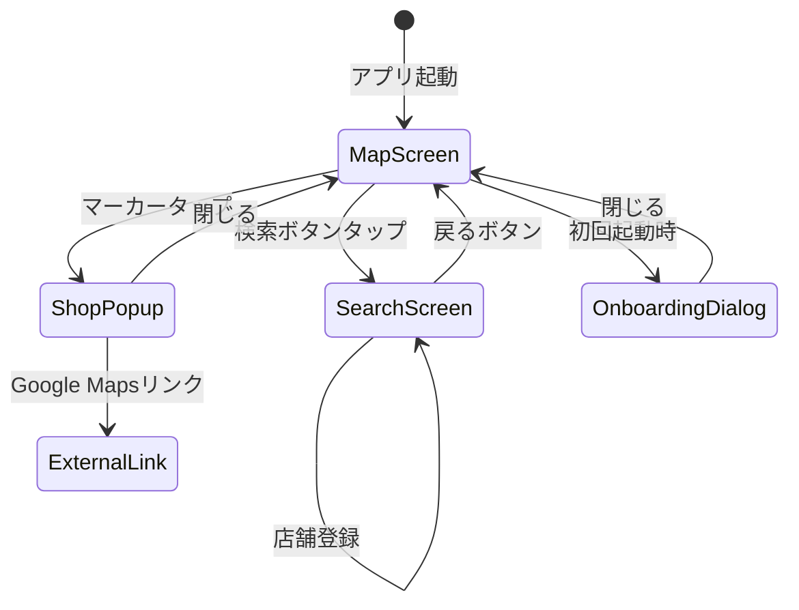
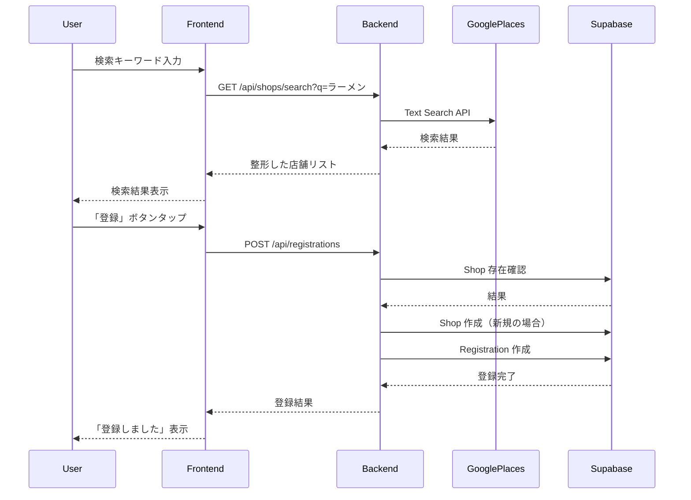
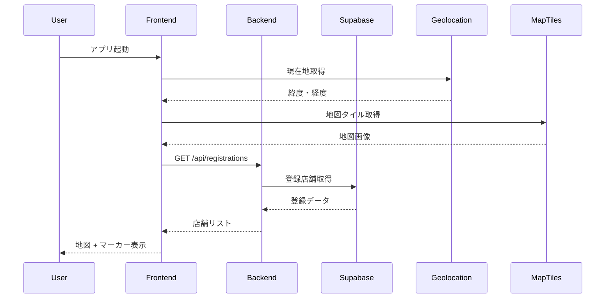

# 機能設計書 (Functional Design Document)

## システム構成図



## 技術スタック

| 分類           | 技術                     | 選定理由                                  |
| -------------- | ------------------------ | ----------------------------------------- |
| フロントエンド | Next.js                  | React ベース、Cloudflare Pages と相性良い |
| バックエンド   | Hono                     | 軽量、Cloudflare Workers と相性良い       |
| ORM            | Prisma                   | 型安全なクエリ、自動マイグレーション      |
| データベース   | Supabase (PostgreSQL)    | 無料枠あり、認証機能内蔵（将来利用）      |
| 地図ライブラリ | Leaflet (React Leaflet)  | 無料、オープンソース、軽量                |
| 店舗検索API    | Google Places API        | 日本のデータが豊富、無料枠あり            |
| ホスティング   | Cloudflare Pages/Workers | 無料枠が充実、クレカ不要                  |
| 言語           | TypeScript               | 型安全性、開発効率                        |

## データモデル定義

### エンティティ: AnonymousUser

```typescript
interface AnonymousUser {
  id: string; // UUID v4（ローカルストレージに保存）
  createdAt: Date; // 初回アクセス日時
}
```

**制約**:

- idはフロントエンドで生成し、ローカルストレージに保存
- サーバーにはAnonymousUserテーブルは作成しない（IDのみ利用）

### エンティティ: Shop

```typescript
interface Shop {
  id: string; // UUID v4
  placeId: string; // Google Places API の Place ID
  name: string; // 店舗名（1-200文字）
  address: string; // 住所
  latitude: number; // 緯度（-90 〜 90）
  longitude: number; // 経度（-180 〜 180）
  category: string; // 料理カテゴリ（例: "ラーメン", "イタリアン"）
  photoUrl?: string; // 店舗画像URL（Google Places API から取得）
  googleMapsUrl: string; // Google Maps へのリンク
  createdAt: Date; // 作成日時
  updatedAt: Date; // 更新日時
}
```

**制約**:

- placeIdはユニーク（同じ店舗の重複登録を防ぐ）
- name, address, category は必須

### エンティティ: Registration

```typescript
interface Registration {
  id: string; // UUID v4
  anonymousUserId: string; // 匿名ユーザーID（FK）
  shopId: string; // 店舗ID（FK）
  createdAt: Date; // 登録日時
}
```

**制約**:

- 同一ユーザーが同一店舗を重複登録できない（anonymousUserId + shopId でユニーク）

### ER図



## API設計

### 店舗検索 API

```
GET /api/shops/search?q={keyword}
```

**クエリパラメータ**:
| パラメータ | 型 | 必須 | 説明 |
|-----------|-----|------|------|
| q | string | Yes | 検索キーワード（1-100文字） |
| lat | number | No | 現在地の緯度（検索結果の並び順に使用） |
| lng | number | No | 現在地の経度（検索結果の並び順に使用） |

**レスポンス（成功）**:

```json
{
  "shops": [
    {
      "placeId": "ChIJ...",
      "name": "らーめん太郎",
      "address": "東京都渋谷区...",
      "latitude": 35.6812,
      "longitude": 139.7671,
      "category": "ラーメン",
      "photoUrl": "https://maps.googleapis.com/...",
      "googleMapsUrl": "https://www.google.com/maps/place/?q=place_id:ChIJ..."
    }
  ]
}
```

**エラーレスポンス**:

- 400 Bad Request: キーワードが空または100文字超過
- 500 Internal Server Error: Google Places API エラー
- 503 Service Unavailable: API利用上限到達

**内部処理**:

1. Google Places API (Text Search) を呼び出し
2. レスポンスから必要な情報を抽出・整形
3. 最大20件まで返却

---

### 店舗登録 API

```
POST /api/registrations
```

**リクエストヘッダ**:
| ヘッダ | 値 | 説明 |
|--------|-----|------|
| X-Anonymous-User-Id | string | 匿名ユーザーID |

**リクエストボディ**:

```json
{
  "placeId": "ChIJ...",
  "name": "らーめん太郎",
  "address": "東京都渋谷区...",
  "latitude": 35.6812,
  "longitude": 139.7671,
  "category": "ラーメン",
  "photoUrl": "https://maps.googleapis.com/...",
  "googleMapsUrl": "https://www.google.com/maps/place/?q=place_id:ChIJ..."
}
```

**レスポンス（成功）**:

```json
{
  "registration": {
    "id": "uuid",
    "shopId": "uuid",
    "createdAt": "2025-01-15T10:00:00.000Z"
  },
  "shop": {
    "id": "uuid",
    "placeId": "ChIJ...",
    "name": "らーめん太郎",
    "address": "東京都渋谷区...",
    "latitude": 35.6812,
    "longitude": 139.7671,
    "category": "ラーメン",
    "photoUrl": "https://maps.googleapis.com/...",
    "googleMapsUrl": "https://www.google.com/maps/place/?q=place_id:ChIJ..."
  }
}
```

**エラーレスポンス**:

- 400 Bad Request: 必須フィールド不足、バリデーションエラー
- 401 Unauthorized: X-Anonymous-User-Id ヘッダがない
- 409 Conflict: 既に登録済み
- 500 Internal Server Error: データベースエラー

**内部処理**:

1. X-Anonymous-User-Id ヘッダを検証
2. リクエストボディをバリデーション
3. Shop テーブルに placeId が存在するか確認
   - 存在しない場合: 新規作成
   - 存在する場合: 既存の shopId を使用
4. Registration テーブルに登録
5. 重複チェック（同一ユーザー・同一店舗の組み合わせ）

---

### 登録店舗一覧取得 API

```
GET /api/registrations
```

**リクエストヘッダ**:
| ヘッダ | 値 | 説明 |
|--------|-----|------|
| X-Anonymous-User-Id | string | 匿名ユーザーID |

**レスポンス（成功）**:

```json
{
  "registrations": [
    {
      "id": "uuid",
      "createdAt": "2025-01-15T10:00:00.000Z",
      "shop": {
        "id": "uuid",
        "placeId": "ChIJ...",
        "name": "らーめん太郎",
        "address": "東京都渋谷区...",
        "latitude": 35.6812,
        "longitude": 139.7671,
        "category": "ラーメン",
        "photoUrl": "https://maps.googleapis.com/...",
        "googleMapsUrl": "https://www.google.com/maps/place/?q=place_id:ChIJ..."
      }
    }
  ]
}
```

**エラーレスポンス**:

- 401 Unauthorized: X-Anonymous-User-Id ヘッダがない
- 500 Internal Server Error: データベースエラー

---

### 店舗登録解除 API

**優先度**: P0（必須）- MVP機能

```
DELETE /api/registrations/{registrationId}
```

**リクエストヘッダ**:
| ヘッダ | 値 | 説明 |
|--------|-----|------|
| X-Anonymous-User-Id | string | 匿名ユーザーID |

**レスポンス（成功）**:

```json
{
  "message": "登録を解除しました"
}
```

**エラーレスポンス**:

- 401 Unauthorized: X-Anonymous-User-Id ヘッダがない
- 403 Forbidden: 他のユーザーの登録を削除しようとした
- 404 Not Found: 登録が見つからない
- 500 Internal Server Error: データベースエラー

## 画面遷移図



## コンポーネント設計

### フロントエンド

#### MapScreen（地図画面）

**責務**:

- 地図の表示と操作
- 現在地の取得と表示
- 登録店舗マーカーの表示
- マーカータップ時のポップアップ表示

**主要な状態**:

```typescript
interface MapScreenState {
  currentLocation: { lat: number; lng: number } | null;
  registrations: Registration[];
  selectedShop: Shop | null;
  isLoading: boolean;
  error: string | null;
}
```

**依存関係**:

- React Leaflet（地図表示）
- Geolocation API（現在地取得）
- API Client（登録店舗取得）

---

#### SearchScreen（検索画面）

**責務**:

- 検索キーワードの入力
- 検索結果の表示
- 店舗の登録処理

**主要な状態**:

```typescript
interface SearchScreenState {
  keyword: string;
  searchResults: SearchResultShop[];
  registeredPlaceIds: Set<string>;
  isSearching: boolean;
  isRegistering: boolean;
  error: string | null;
}
```

**依存関係**:

- API Client（店舗検索、店舗登録）

---

#### ShopPopup（店舗詳細ポップアップ）

**責務**:

- 店舗詳細情報の表示
- Google Mapsリンクの提供
- 登録解除機能の提供

**Props**:

```typescript
interface ShopPopupProps {
  shop: Shop;
  registrationId: string; // 削除時に必要
  registrationDate: Date;
  onClose: () => void;
  onDelete?: (registrationId: string) => void; // 登録解除ハンドラ
}
```

---

#### OnboardingDialog（初回起動ダイアログ）

**責務**:

- 初回起動時の説明表示
- データ消失リスクの通知

**Props**:

```typescript
interface OnboardingDialogProps {
  isOpen: boolean; // ダイアログ表示状態
  onClose: () => void; // 閉じるハンドラ
}
```

**状態管理**:

- `hasSeenOnboarding`: LocalStorageに保存（キー: `meshi-map:onboarding-seen`）
- 初回起動時のみ`true`でダイアログを表示
- 「閉じる」ボタン押下でLocalStorageに`true`を保存

**表示内容**:

1. アプリの使い方（3ステップ）
2. データはこのブラウザにのみ保存される旨
3. ブラウザのキャッシュクリアでデータが消える旨

### バックエンド

#### ShopSearchService

**責務**:

- Google Places API との通信
- 検索結果の整形

```typescript
class ShopSearchService {
  async search(
    keyword: string,
    location?: { lat: number; lng: number }
  ): Promise<SearchResultShop[]>;
}
```

---

#### RegistrationService

**責務**:

- 店舗登録のビジネスロジック
- 重複チェック

```typescript
class RegistrationService {
  async register(anonymousUserId: string, shopData: ShopData): Promise<Registration>;
  async list(anonymousUserId: string): Promise<RegistrationWithShop[]>;
  async delete(anonymousUserId: string, registrationId: string): Promise<void>;
}
```

---

#### ShopRepository

**責務**:

- Shop テーブルへのアクセス

```typescript
class ShopRepository {
  async findByPlaceId(placeId: string): Promise<Shop | null>;
  async create(shopData: ShopData): Promise<Shop>;
}
```

---

#### RegistrationRepository

**責務**:

- Registration テーブルへのアクセス

```typescript
class RegistrationRepository {
  async findByUserAndShop(anonymousUserId: string, shopId: string): Promise<Registration | null>;
  async findAllByUser(anonymousUserId: string): Promise<RegistrationWithShop[]>;
  async create(anonymousUserId: string, shopId: string): Promise<Registration>;
  async delete(id: string): Promise<void>;
}
```

## ユースケース図

### 店舗検索・登録フロー



### 地図表示フロー



## UI設計

### 地図画面

```
┌─────────────────────────────────────┐
│ [現在地] めしマップ           [検索]│ ← ヘッダー
├─────────────────────────────────────┤
│                                     │
│         ┌─────┐                     │
│         │  📍 │ ← 現在地マーカー     │
│         └─────┘                     │
│                                     │
│    🍜          🍣                   │ ← 登録店舗マーカー
│                                     │
│              🍕                     │
│                                     │
│                                     │
└─────────────────────────────────────┘
```

### 検索画面

```
┌─────────────────────────────────────┐
│ [←] 店舗を検索                      │
├─────────────────────────────────────┤
│ ┌─────────────────────────────────┐ │
│ │ 🔍 ラーメン                      │ │ ← 検索入力
│ └─────────────────────────────────┘ │
├─────────────────────────────────────┤
│ ┌─────────────────────────────────┐ │
│ │ 🖼️  らーめん太郎                 │ │
│ │     東京都渋谷区...              │ │
│ │     ラーメン                     │ │
│ │                       [登録]    │ │
│ └─────────────────────────────────┘ │
│ ┌─────────────────────────────────┐ │
│ │ 🖼️  麺屋 花子                   │ │
│ │     東京都新宿区...              │ │
│ │     ラーメン          [登録済み] │ │
│ └─────────────────────────────────┘ │
└─────────────────────────────────────┘
```

### 店舗詳細ポップアップ

```
┌─────────────────────────────────────┐
│                               [×]  │
│ ┌─────────────────────────────────┐ │
│ │                                 │ │
│ │         店舗画像                 │ │
│ │                                 │ │
│ └─────────────────────────────────┘ │
│                                     │
│ らーめん太郎                        │
│ 東京都渋谷区道玄坂1-2-3             │
│ カテゴリ: ラーメン                   │
│ 登録日: 2025年1月15日               │
│                                     │
│ ┌─────────────────────────────────┐ │
│ │      Google Maps で開く          │ │
│ └─────────────────────────────────┘ │
└─────────────────────────────────────┘
```

### マーカーデザイン

| マーカー種類 | アイコン | 色  |
| ------------ | -------- | --- |
| 現在地       | 📍       | 青  |
| 登録店舗     | 🍴       | 赤  |

## エラーハンドリング

### エラーの分類

| エラー種別                       | 処理                                       | ユーザーへの表示                                                     |
| -------------------------------- | ------------------------------------------ | -------------------------------------------------------------------- |
| 位置情報取得失敗                 | 東京駅を初期位置として表示                 | 「位置情報を取得できませんでした。手動で地図を操作してください」     |
| 検索結果0件                      | 空の結果を表示                             | 「検索結果が見つかりませんでした。別のキーワードで試してください」   |
| 検索API エラー                   | リトライボタンを表示                       | 「検索に失敗しました。しばらくしてから再度お試しください」           |
| 登録API エラー                   | リトライボタンを表示                       | 「登録に失敗しました。しばらくしてから再度お試しください」           |
| 重複登録                         | 何もしない（UIで防止）                     | 「この店舗は既に登録済みです」                                       |
| ネットワークエラー               | オフライン表示                             | 「インターネットに接続されていません」                               |
| API利用上限到達                  | サービス停止表示                           | 「現在サービスを一時停止しています。しばらくしてからお試しください」 |
| 認証エラー (401)                 | ローカルストレージを確認し、匿名IDを再生成 | 「セッションが無効です。ページを再読み込みしてください」             |
| データベース接続エラー           | リトライボタンを表示                       | 「データベースに接続できません。しばらくしてから再度お試しください」 |
| 不正な匿名ID形式                 | ローカルストレージをクリアし、新規ID生成   | 「データが破損しています。リセットして再度お試しください」           |
| 他ユーザーのデータアクセス (403) | エラー表示                                 | 「このデータにはアクセスできません」                                 |

## セキュリティ考慮事項

| 考慮事項                   | 対策                                                                         |
| -------------------------- | ---------------------------------------------------------------------------- |
| Google Places API キー露出 | バックエンド（Cloudflare Workers）でのみ使用、フロントエンドに露出しない     |
| SQLインジェクション        | Supabase クライアントのパラメータバインディングを使用                        |
| XSS                        | React のデフォルトエスケープ機能を活用、dangerouslySetInnerHTML を使用しない |
| 不正な匿名ユーザーID       | UUID v4 フォーマットのバリデーション                                         |
| 他ユーザーのデータアクセス | 全ての API で X-Anonymous-User-Id による認可チェック                         |
| HTTPS                      | Cloudflare が自動で HTTPS を提供                                             |

## パフォーマンス最適化

| 最適化項目         | 手法                                                  | 目標値                    | 測定方法             |
| ------------------ | ----------------------------------------------------- | ------------------------- | -------------------- |
| 地図タイル読み込み | Leaflet のデフォルトキャッシュを活用                  | 2回目以降の表示1秒以内    | Performance API      |
| 登録店舗一覧       | アプリ起動時に1回だけ取得、以降は状態管理で保持       | API呼び出し1回/セッション | Network タブで計測   |
| 検索結果           | デバウンス処理（500ms）で API 呼び出し回数を削減      | API呼び出し70%削減        | Network タブで計測   |
| 画像読み込み       | 遅延読み込み（lazy loading）を適用                    | LCP 2.5秒以内             | Lighthouse           |
| マーカー表示       | 100件以上の場合はクラスタリング表示を検討（将来対応） | 30fps以上を維持           | DevTools Performance |

**パフォーマンス目標（architecture.md準拠）**:

- 地図初期表示: 2秒以内
- 店舗検索結果表示: 3秒以内（API応答時間含む）
- 店舗登録: 1秒以内
- フロントエンド バンドルサイズ: 500KB (gzip) 以内

## テスト戦略

### ユニットテスト

**フレームワーク**: Vitest
**カバレッジ目標**: 80%
**モック戦略**:

- Google Places API: MSW（Mock Service Worker）でモック
- Prisma: prismock または vitest-mock-extended でモック

**対象**:
| コンポーネント | テストケース |
|--------------|-------------|
| ShopSearchService | 正常系: キーワード検索が成功する |
| ShopSearchService | 異常系: API応答が不正な形式の場合 |
| ShopSearchService | 境界値: キーワードが100文字ちょうどの場合 |
| RegistrationService | 正常系: 新規店舗の登録が成功する |
| RegistrationService | 異常系: 重複登録でエラーになる |
| バリデーション関数 | UUID v4形式の検証 |
| バリデーション関数 | 緯度・経度の範囲検証 |

### 統合テスト

**フレームワーク**: Vitest + Prisma（テスト用DB）

**対象**:
| エンドポイント | テストケース |
|--------------|-------------|
| GET /api/shops/search | 正常系: 検索結果が返却される |
| GET /api/shops/search | 異常系: 空キーワードで400エラー |
| POST /api/registrations | 正常系: 店舗登録が成功する |
| POST /api/registrations | 異常系: 重複登録で409エラー |
| GET /api/registrations | 正常系: 登録一覧が取得できる |
| DELETE /api/registrations/{id} | 正常系: 登録解除が成功する |
| DELETE /api/registrations/{id} | 異常系: 他ユーザーの登録で403エラー |

### E2Eテスト

**フレームワーク**: Playwright

**シナリオ**:
| シナリオ | 検証内容 |
|---------|---------|
| 店舗検索→登録→地図表示 | 一連のフローが正常に動作する |
| 初回起動時のオンボーディング | ダイアログが表示され、閉じると再表示されない |
| エラー時のUI表示 | ネットワークエラー時に適切なメッセージが表示される |
| 登録解除フロー | 登録済み店舗を削除できる |
